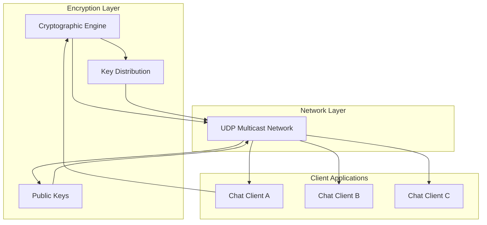
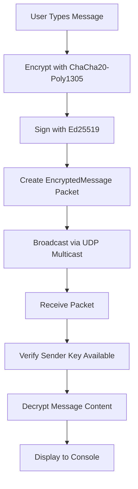

# Agora - Secure Decentralized Chat System

Agora is a fully decentralized, end-to-end encrypted chat system that communicates securely over UDP multicast without requiring a central server.

## Overview

Agora enables multiple clients to establish secure, private communication in a peer-to-peer network. The system features:

- **End-to-End Encryption**: All messages are encrypted using ChaCha20-Poly1305 authenticated encryption
- **Identity Management**: Ed25519/X25519 cryptographic keys for secure identity verification and key exchange
- **Dynamic Key Distribution**: Automated sender key distribution for group chat cryptography
- **UDP Multicast Transport**: Efficient broadcast communication to all group members
- **Peer Discovery**: Automatic public key exchange and peer identification
- **Message Buffaloing**: Intelligence handling of messages from unknown senders with automatic key requests

## Key Components

*   **CLI (Command Line Interface)**: Parses command-line arguments for chat configuration, including identity files, multicast addresses, log levels, and network interfaces. Uses `clap` for robust argument handling.

*   **Crypto**: Implements the cryptographic core of the secure chat system.
    *   Authentication using Ed25519 digital signatures for message integrity
    *   Key exchange using X25519 for establishing shared secrets
    *   Symmetric encryption using ChaCha20-Poly1305 for message confidentiality
    *   Sender key distribution for secure group communication
    *   Cryptographic error handling and key management

*   **Identity Management**: Handles user identity and cryptographic keys.
    *   **MyIdentity**: Represents the local user's cryptographic identity using SSH keys
    *   **PeerIdentity**: Manages known peers and their public keys
    *   Automatic loading of Ed25519 keys from SSH key files (typically `~/.ssh/id_ed25519`)
    *   Key validation and peer discovery mechanisms

*   **NetworkManager**: Handles UDP multicast communication with enhanced security.
    *   Binds to multicast addresses for peer-to-peer communication
    *   Manages network interface binding for robust connectivity
    *   Implements message broadcasting and reception over `239.255.255.250:8080`
    *   Uses `socket2` for advanced socket configuration and performance optimization
    *   Handles encryption packet transmission and reception

*   **Processor**: Orchestrates asynchronous tasks with enhanced encryption support.
    *   **UDP Intake Task**: Receives multicast packets and processes encrypted content
    *   **Message Display Task**: Decrypts and displays chat messages to console
    *   **Stdin Input Task**: Encrypts user input and sends through multicast
    *   Handles public key announcements for peer discovery
    *   Manages encrypted sender key distributions
    *   Buffers messages from unknown senders until keys are available
    *   Processes public key requests to resolve unknown senders

*   **Protocol Buffers Schema**: Defines cryptographic message formats in `proto/chat.proto`.
    *   **ChatPacket**: Top-level container with oneof variant types
    *   **PublicKeyAnnouncement**: Announces user identity and public keys
    *   **KeyDistribution**: Distributes encrypted sender keys to recipients
    *   **EncryptedMessage**: Contains ChaCha20-Poly1305 encrypted message content
    *   **PublicKeyRequest**: Requests missing public keys for unknown senders
    *   Autogenerated Rust types via `prost-build`

## Development

### Prerequisites

*   [Rust](https://www.rust-lang.org/tools/install) (edition 2024 or later)
*   [Protocol Buffers Compiler](https://grpc.io/docs/protoc-installation/) for building message schemas
*   SSH key pair for identity (automatically uses `~/.ssh/id_ed25519` if available)

### Cryptographic Dependencies

The project uses several cryptographic libraries (automatically managed by Cargo):
* **ed25519-dalek**: Ed25519 signatures for message authentication
* **x25519-dalek**: X25519 elliptic curve for key exchange
* **chacha20poly1305**: ChaCha20 stream cipher with Poly1305 MAC for authenticated encryption
* **ssh-key**: SSH key format support for identity management

### Building the Project

To build the project, run the following command:

```sh
cargo build
```

The build process will:
1. Compile the Protocol Buffer schemas into Rust code
2. Build all cryptographic and networking components
3. Generate optimized binary with cryptographic optimizations

### Running Tests

To run the test suite, use the following command:

```sh
cargo test
```

### Building the Protocol Buffers

The project uses Protocol Buffers for cryptographic message serialization. The build script automatically compiles `.proto` files when you run `cargo build`, generating type-safe Rust structs for all packet types.

## Command Line Usage

Agora supports several command-line options to configure secure chat operation:

### Basic Usage

```sh
cargo run -- --help
cargo run -- -c team-chat
cargo run -- -c team-chat -l debug -m 239.255.100.1:8080
```

### Available Options

| Flag | Long Form | Default | Description |
|------|-----------|---------|-------------|
| `-c` | `--chat-id` | auto-generated UUID | Unique identifier for this chat session |
| `-l` | `--log-level` | `info` | Logging verbosity (error, warn, info, debug, trace) |
| `-m` | `--multicast-address` | `239.255.255.250:8080` | UDP multicast address and port |
| `-i` | `--interface` | none | Network interface to bind to (eth0, wlan0, etc.) |
| `-k` | `--key-file` | `~/.ssh/id_ed25519` | Path to Ed25519 SSH private key for identity |

### Examples

**Start a chat with custom ID:**
```sh
cargo run -- -c i_am_alice
```

**Debug mode with custom multicast:**
```sh
cargo run -- -c debug-session -l debug -m 239.255.255.250:9090
```

**Use specific network interface:**
```sh
cargo run -- -c suzie -i wlan0
```

**Use custom SSH key:**
```sh
cargo run -- -k /path/to/custom/key
```

### Identity Management

By default, Agora uses your SSH Ed25519 key (`~/.ssh/id_ed25519`) for cryptographic identity. This key:
- Signs all messages for authenticity
- Enables secure key exchange with peers
- Should be kept secure as it uniquely identifies you in chat sessions

If no SSH key exists, generate one with:
```sh
ssh-keygen -t ed25519 -f ~/.ssh/id_ed25519 -C "agora-identity"
```

## Security Architecture & Message Flow

### Security Features

Agora implements a comprehensive security model:

- **Cryptographic Keys**: Uses Curve25519 (X25519) for key exchange and Ed25519 for signatures
- **Authenticated Encryption**: ChaCha20-Poly1305 provides confidentiality and authenticity
- **Sender Keys**: Thin-threaded keys for efficient group chat encryption
- **Peer Authentication**: Public key announcements verify participant identities
- **Automatic Key Discovery**: Buffers messages from unknown senders while requesting keys
- **No Central Authority**: Decentralized trust through cryptographic verification

### Message Flow Architecture

When a user types a message, it undergoes encryption and distribution:

1. **User Input** → Processor encrypts plaintext with sender key
2. **Encryption** → ChaCha20-Poly1305 encrypts message content + signature verification
3. **Key Distribution** → Encrypted sender keys distributed to all group members
4. **Broadcast** → Encrypted message sent via UDP multicast to all peers
5. **Decryption** → Recipients decrypt messages using shared sender key
6. **Verification** → Ed25519 signatures verify message authenticity and integrity

### High-Level Message Flow



### Detailed Packet Flow



## License

This project is licensed under the MIT License. See the `LICENSE` file for details.