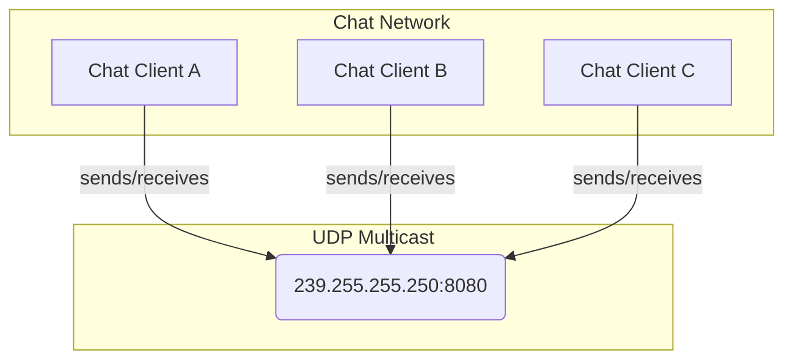
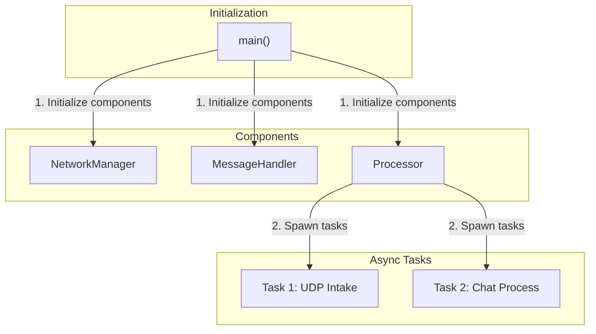
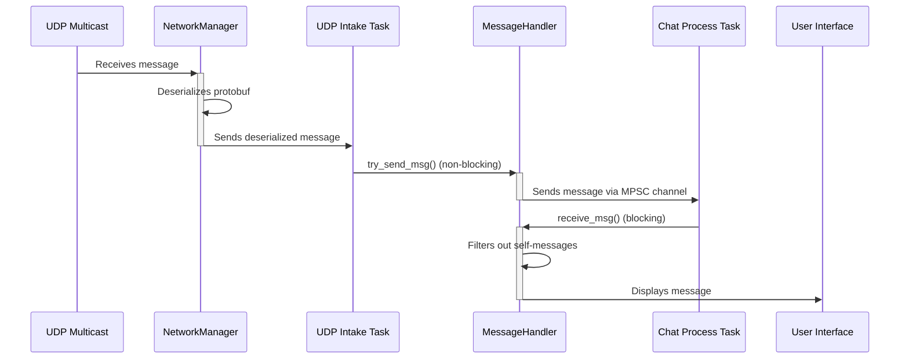
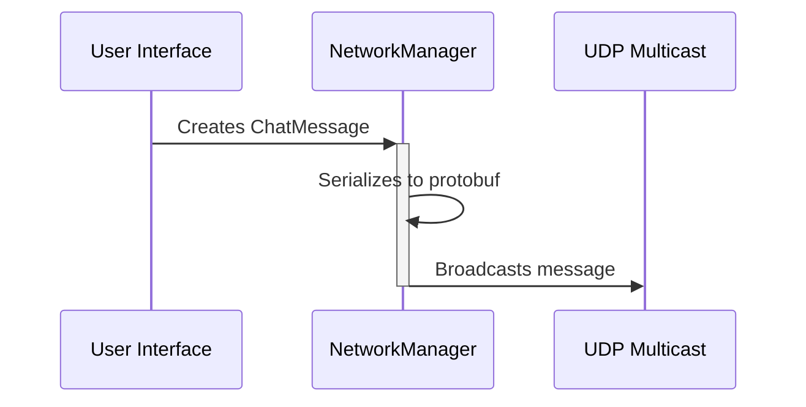

# Agora - A Fully Decentralized Chat System

Agora is a fully decentralized chat system communicating over UDP multicast.

## Overview

Agora allows multiple clients to communicate with each other in a peer-to-peer fashion without a central server. Messages are broadcasted to a multicast group, and every member of the group receives the messages.

## Development

### Prerequisites

*   [Rust](https://www.rust-lang.org/tools/install)
*   [Protocol Buffers Compiler](https://grpc.io/docs/protoc-installation/)

### Building the Project

To build the project, run the following command:

```sh
cargo build
```

### Running Tests

To run the test suite, use the following command:

```sh
cargo test
```

### Building the Protocol Buffers

The project uses Protocol Buffers for message serialization. If you modify the `.proto` files, you'll need to rebuild the generated Rust code. The build script handles this automatically when you run `cargo build`.

## Message Flow Architecture

The following diagrams illustrate how messages traverse through the Agora chat system.

### High-Level Message Flow



### Single Chat App Detail



### Detailed Message Flow

#### Incoming Message Flow



#### Outgoing Message Flow



## Key Components

*   **NetworkManager**: Handles UDP multicast communication, including sending and receiving messages. It uses `socket2` for advanced socket configuration.
*   **MessageHandler**: Manages the MPSC channel for decoupling network I/O from message processing.
*   **Processor**: Orchestrates the asynchronous tasks for handling incoming and outgoing messages.
*   **ChatMessage (protobuf)**: The data structure for chat messages, defined in `.proto` files.

## License

This project is licensed under the MIT License. See the `LICENSE` file for details.