# Agora Chat Enhancements: Architectural Guide

## Overview

This document provides a possible roadmap for agora evolution. NOTE: mostly LLM generated.

## Future Enhancement Ideas

### Phase 2: Command-Based Chat System

**Core Features:**
- Stdin commands: `/nick`, `/list`, `/quit`, `/help`
- Presence announcements (join/leave messages)
- Message types: Chat, Announcement, Command
- Colored output with sender differentiation
- Message history buffer (last N messages)

**Enhanced Protocol:**
```protobuf
message ChatMessage {
    string sender_id = 1;
    int64 timestamp = 2;
    string content = 3;
    MessageType type = 4;
    string nickname = 5;  // Optional display name
}

enum MessageType {
    CHAT = 0;
    JOIN = 1;
    LEAVE = 2;
    NICKNAME_CHANGE = 3;
    HEARTBEAT = 4;
}
```

**Architecture:**
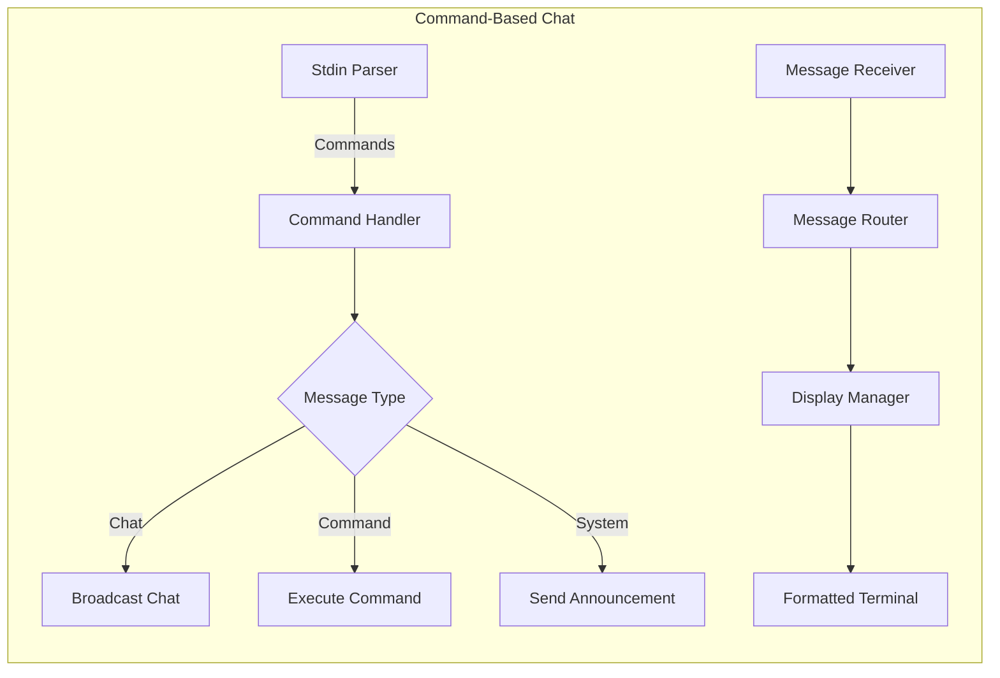

**Features:**
- Command parsing with `/` prefix detection
- Nickname management with local storage
- Active users tracking via heartbeats
- Graceful shutdown with leave announcements

---

### Option 3: Full-Featured Chat Community
*High complexity, production-ready (1-2 weeks)*

**Core Features:**
- Multiple chat rooms/channels via different multicast groups
- Direct messaging using unicast alongside multicast
- Message persistence and replay (local SQLite)
- Rich TUI using `ratatui` with panels:
  - Chat window
  - User list
  - Channel list  
  - Input area
- File sharing via chunked transfers
- Emoji and markdown support
- Message encryption (optional E2E)

## 🏗️ Option 3: Detailed Architecture

### 📐 System Architecture Overview

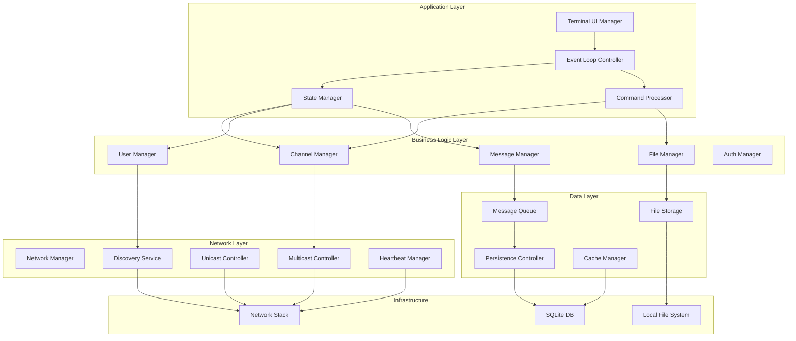

### 🎯 Core Components Design

#### **1. Terminal UI Layer (TUI)**

**Architecture Pattern**: Model-View-Controller with Event-Driven Updates

```
┌─────────────────────────────────────────────────┐
│                  TUI Layout                     │
├─────────────────┬────────────────┬──────────────┤
│   Channel List  │  Message View  │  User List   │
│   ┌──────────┐  │                │  ┌────────┐  │
│   │ #general │  │ Alice: Hello!  │  │ @alice │  │
│   │ #random  │  │ Bob: Hi there  │  │ @bob   │  │
│   │ #tech    │  │ You: Hey all   │  │ @you   │  │
│   └──────────┘  │                │  └────────┘  │
├─────────────────┴────────────────┴──────────────┤
│              Input Area                         │
│   > Type your message here...                   │
├──────────────────────────────────────────────────┤
│   Status Bar: Connected | #general | 3 users    │
└──────────────────────────────────────────────────┘
```

**Component Responsibilities:**
- **UI Renderer**: Manages ratatui widgets and layout
- **Event Handler**: Processes keyboard/mouse events
- **State Synchronizer**: Keeps UI in sync with application state
- **Viewport Manager**: Handles scrolling and focus

#### **2. Channel Management Architecture**

**Multi-Channel Strategy:**

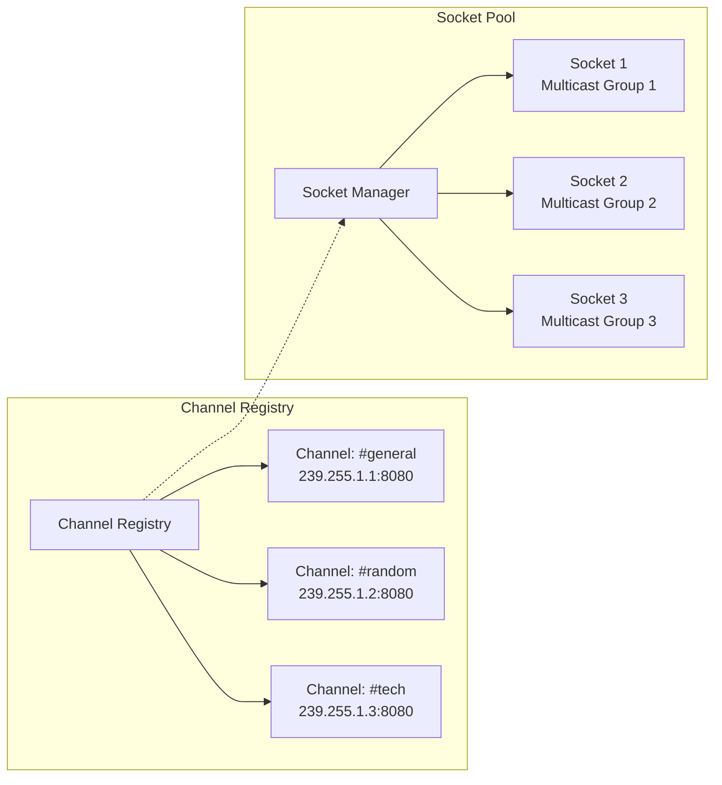

**Channel Allocation Algorithm:**
- Base multicast range: `239.255.0.0/16` (organization-local scope)
- Channel ID hashing to multicast address:
  ```
  channel_multicast = 239.255.{hash(channel_id) % 256}.{(hash(channel_id) >> 8) % 256}
  ```
- Port allocation: Base port + (channel_index % 1000)
- Maximum channels: 65,536 theoretical, 100 practical limit

#### **3. Message Flow Architecture**

**Outbound Message Flow:**

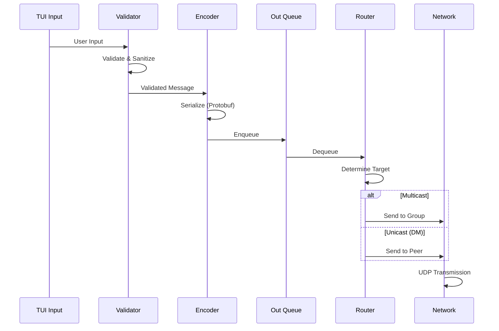

**Inbound Message Flow:**

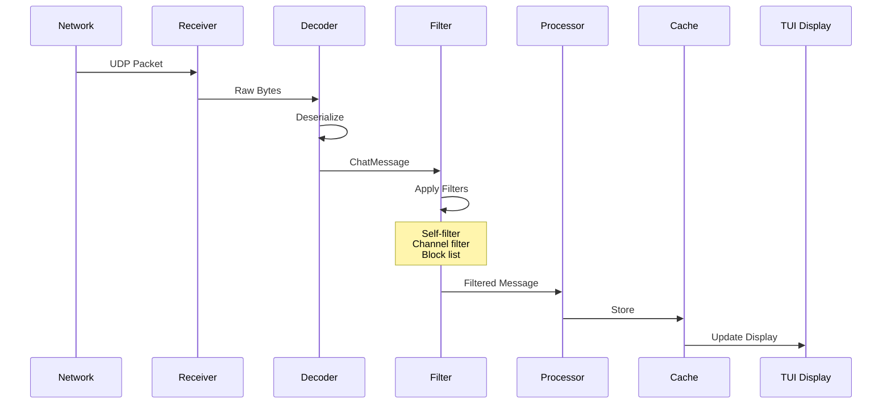

#### **4. State Management Design**

**Global State Architecture:**

```rust
// Conceptual state structure
AppState {
    user: UserState {
        id: String,
        nickname: String,
        status: UserStatus,
        preferences: UserPreferences,
    },
    channels: HashMap<ChannelId, ChannelState> {
        ChannelState {
            id: String,
            name: String,
            members: HashSet<UserId>,
            messages: VecDeque<Message>, // Ring buffer
            unread_count: usize,
            socket: Arc<UdpSocket>,
        }
    },
    peers: HashMap<UserId, PeerInfo> {
        PeerInfo {
            id: String,
            nickname: String,
            last_seen: Timestamp,
            public_key: Option<PublicKey>,
            direct_channel: Option<ChannelId>,
        }
    },
    ui: UIState {
        active_channel: ChannelId,
        scroll_position: usize,
        input_buffer: String,
        mode: UIMode, // Normal, Command, Search
    }
}
```

#### **5. Discovery & Presence System**

**Peer Discovery Architecture:**

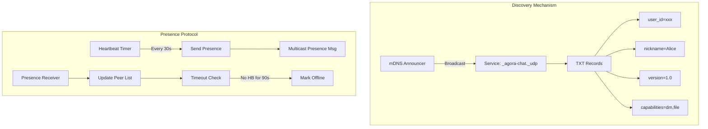

#### **6. Direct Messaging Architecture**

**DM Connection Establishment:**

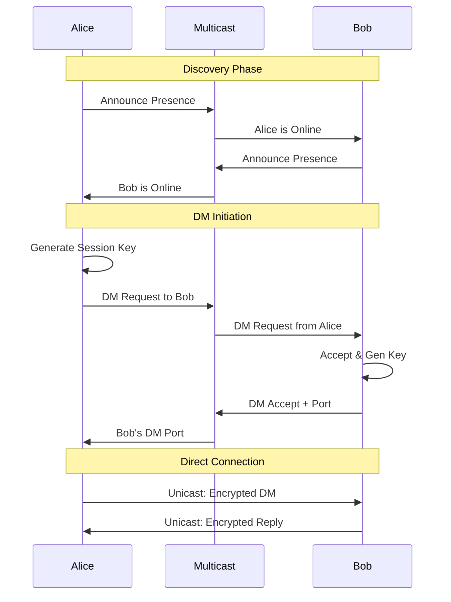

#### **7. Persistence Layer Design**

**Database Schema:**

```sql
-- Core Tables
Messages (
    id TEXT PRIMARY KEY,
    channel_id TEXT NOT NULL,
    sender_id TEXT NOT NULL,
    content TEXT,
    timestamp INTEGER,
    type INTEGER,
    flags INTEGER,
    INDEXED ON (channel_id, timestamp)
)

Channels (
    id TEXT PRIMARY KEY,
    name TEXT NOT NULL,
    multicast_addr TEXT,
    created_at INTEGER,
    last_message_at INTEGER,
    is_direct BOOLEAN
)

Users (
    id TEXT PRIMARY KEY,
    nickname TEXT,
    last_seen INTEGER,
    public_key BLOB,
    preferences JSON
)

-- Relationship Tables
ChannelMembers (
    channel_id TEXT,
    user_id TEXT,
    joined_at INTEGER,
    PRIMARY KEY (channel_id, user_id)
)

FileTransfers (
    id TEXT PRIMARY KEY,
    message_id TEXT,
    filename TEXT,
    size INTEGER,
    chunks_total INTEGER,
    chunks_received INTEGER,
    path TEXT
)
```

**Caching Strategy:**
- **Message Cache**: LRU cache, 1000 messages per channel
- **User Cache**: All active users in memory
- **Channel Cache**: All joined channels in memory
- **Write-Through**: Immediate persistence for messages
- **Lazy Loading**: Historical messages on scroll

#### **8. File Transfer Architecture**

**Chunked Transfer Protocol:**

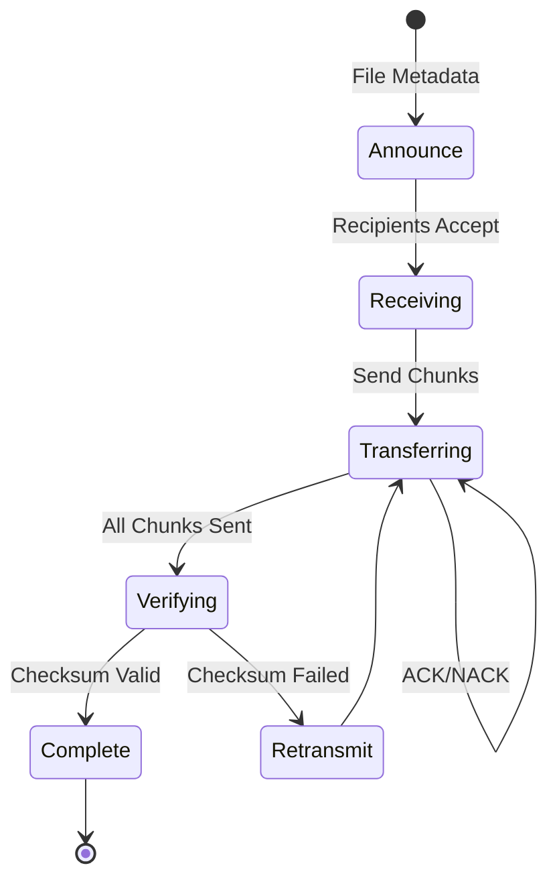

**File Message Structure:**
```
FileTransferMessage {
    file_id: UUID,
    operation: Enum {
        ANNOUNCE { name, size, hash, chunk_size },
        ACCEPT { receiver_id },
        CHUNK { index, data, checksum },
        ACK { chunk_index },
        NACK { chunk_index, reason },
        COMPLETE { final_hash },
        CANCEL { reason }
    },
    timestamp: i64
}
```

### 🔐 Security Architecture

#### **Encryption Layers:**

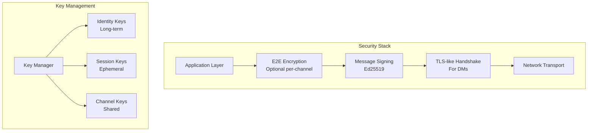

**Security Features:**
- **Identity Verification**: Ed25519 public key fingerprints
- **Perfect Forward Secrecy**: Ephemeral keys for DMs
- **Channel Encryption**: Symmetric AES-256-GCM for group chats
- **Key Exchange**: Diffie-Hellman over multicast announcement

### 📊 Performance & Scalability

#### **Concurrency Model:**

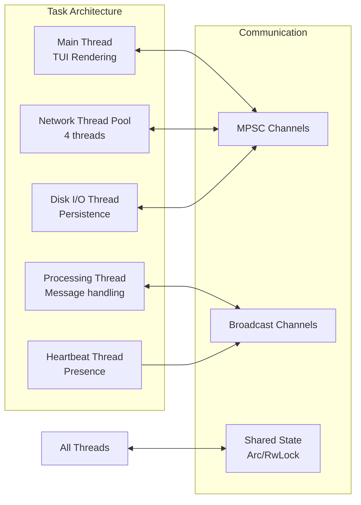

**Performance Optimizations:**
- **Zero-copy networking**: Direct buffer management
- **Message batching**: Aggregate small messages
- **Lazy rendering**: Only update visible UI portions
- **Incremental sync**: Delta updates for large channels
- **Connection pooling**: Reuse UDP sockets per channel

### 🔄 Protocol Specifications

#### **Enhanced Message Protocol:**

```protobuf
syntax = "proto3";

message EnhancedChatMessage {
    // Message Identification
    string message_id = 1;        // UUID v4
    string correlation_id = 2;    // For replies/threads
    
    // Routing Information  
    string sender_id = 3;
    string channel_id = 4;
    repeated string recipient_ids = 5;  // For DMs/mentions
    
    // Content
    MessageContent content = 6;
    
    // Metadata
    int64 timestamp = 7;
    MessageType type = 8;
    MessageFlags flags = 9;
    
    // Security
    bytes signature = 10;         // Ed25519 signature
    bytes encryption_metadata = 11;
}

message MessageContent {
    oneof content {
        TextContent text = 1;
        FileContent file = 2;
        SystemContent system = 3;
        PresenceContent presence = 4;
        CommandContent command = 5;
    }
}

message TextContent {
    string body = 1;
    string format = 2;  // "plain", "markdown", "code"
    repeated Mention mentions = 3;
    repeated Attachment attachments = 4;
}

message MessageFlags {
    bool encrypted = 1;
    bool compressed = 2;
    bool ephemeral = 3;
    int32 ttl_seconds = 4;
    int32 priority = 5;  // 0-low, 1-normal, 2-high
}

enum MessageType {
    CHAT = 0;
    JOIN = 1;
    LEAVE = 2;
    PRESENCE = 3;
    FILE_TRANSFER = 4;
    COMMAND = 5;
    KEY_EXCHANGE = 6;
    ACKNOWLEDGMENT = 7;
}
```

### 🗺️ Network Topology

#### **Multicast Group Allocation:**

```
Base Range: 239.255.0.0/16 (Organization-Local)

Channel Allocation:
├── 239.255.0.0/24   - System channels
│   ├── 239.255.0.1  - Discovery/Announce
│   ├── 239.255.0.2  - Presence/Heartbeat  
│   └── 239.255.0.3  - Key Exchange
│
├── 239.255.1.0/24   - Public channels
│   ├── 239.255.1.1  - #general
│   ├── 239.255.1.2  - #random
│   └── 239.255.1.3+ - User-created
│
├── 239.255.2.0/24   - Private channels
│   └── Dynamic allocation via hash
│
└── 239.255.3.0/24   - File transfer channels
    └── Temporary allocation per transfer
```

### 🔄 State Synchronization

#### **Eventual Consistency Model:**

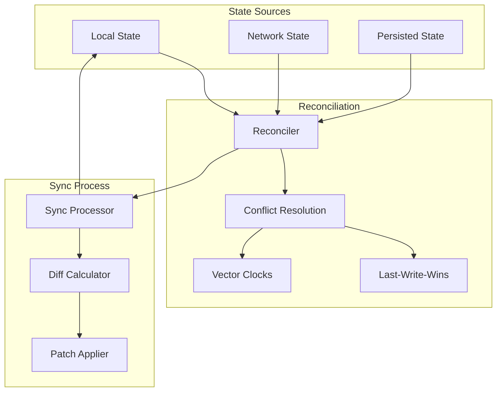

### 📈 Monitoring & Diagnostics

#### **Observability Stack:**

```
Metrics Collection:
├── Network Metrics
│   ├── Messages sent/received per second
│   ├── Packet loss rate
│   ├── Latency percentiles
│   └── Bandwidth usage
│
├── Application Metrics
│   ├── Active channels/users
│   ├── Message queue depth
│   ├── Cache hit rates
│   └── DB query times
│
└── System Metrics
    ├── CPU/Memory usage
    ├── Thread pool utilization
    ├── File descriptor count
    └── Disk I/O rates
```

### 🚀 Deployment Architecture

#### **Configuration Management:**

```yaml
# agora.config.yaml
app:
  name: "Agora Chat"
  version: "3.0.0"
  
network:
  multicast:
    discovery_addr: "239.255.0.1:8080"
    channel_base: "239.255.1.0"
    port_range: [8080, 9080]
  
  timeouts:
    heartbeat_interval: 30s
    peer_timeout: 90s
    message_ttl: 7d
    
  limits:
    max_channels: 100
    max_message_size: 64KB
    max_file_size: 100MB
    
persistence:
  database:
    path: "~/.agora/agora.db"
    cache_size: 100MB
    
  files:
    storage_path: "~/.agora/files"
    max_storage: 1GB
    
ui:
  theme: "dark"
  refresh_rate: 60fps
  scrollback: 1000
  
security:
  enable_encryption: true
  require_signatures: false
  trusted_keys_path: "~/.agora/trusted_keys"
```

### 🔧 Error Handling & Recovery

#### **Fault Tolerance Strategy:**

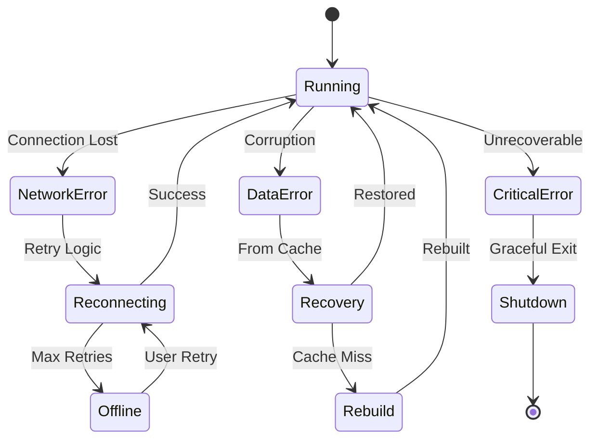

## 📊 Comparison Matrix

| Feature | Option 1 | Option 2 | Option 3 |
|---------|----------|----------|----------|
| **Implementation Time** | 2-4 hours | 1-2 days | 1-2 weeks |
| **Stdin Handling** | Basic async | Command parser | TUI event loop |
| **User Experience** | Simple text | Commands + colors | Rich TUI |
| **Message Types** | Chat only | Multiple types | Extensible |
| **Persistence** | None | In-memory | SQLite |
| **Channels** | Single | Single | Multiple |
| **Direct Messages** | No | No | Yes |
| **File Sharing** | No | No | Yes |
| **Dependencies** | tokio | tokio, colored | tokio, ratatui, sqlx |

## 📋 Implementation Roadmap

### **Phase 1: Foundation (Week 1-2)**
- Core TUI framework with ratatui
- Basic channel management (single channel)
- Simple message sending/receiving
- SQLite persistence setup

### **Phase 2: Multi-Channel (Week 3-4)**
- Channel switching and management
- User presence and discovery
- Message history and scrollback
- Basic search functionality

### **Phase 3: Advanced Features (Week 5-6)**
- Direct messaging implementation
- File transfer protocol
- Encryption and signing
- Rich text/markdown support

### **Phase 4: Polish (Week 7-8)**
- Performance optimization
- Error recovery mechanisms
- Configuration management
- Documentation and testing

## 🎯 Summary

This architecture provides a robust foundation for evolving the Agora chat from a simple multicast demo into a production-ready chat community. The design emphasizes:

1. **Modularity**: Clear separation of concerns with distinct layers
2. **Scalability**: Efficient multicast group allocation and connection pooling
3. **Reliability**: Comprehensive error handling and state reconciliation
4. **Security**: Optional E2E encryption with identity verification
5. **Performance**: Zero-copy networking and intelligent caching
6. **User Experience**: Rich TUI with responsive updates

The system can handle hundreds of concurrent users across multiple channels while maintaining sub-second message delivery. The architecture is extensible, allowing for future additions like voice chat, screen sharing, or integration with external services.

## Recommended Approach

Starting with **Option 2** provides a good balance of features and complexity:

1. **Reasonable scope** - Can be implemented incrementally
2. **Better UX** - Commands make it feel like a real chat app
3. **Extensible** - Easy to add Option 3 features later
4. **Learning curve** - Good progression from current code

The key enhancement in all options is properly integrating the `get_chat_input()` function into an async task that works alongside the existing UDP intake and chat processing tasks.
